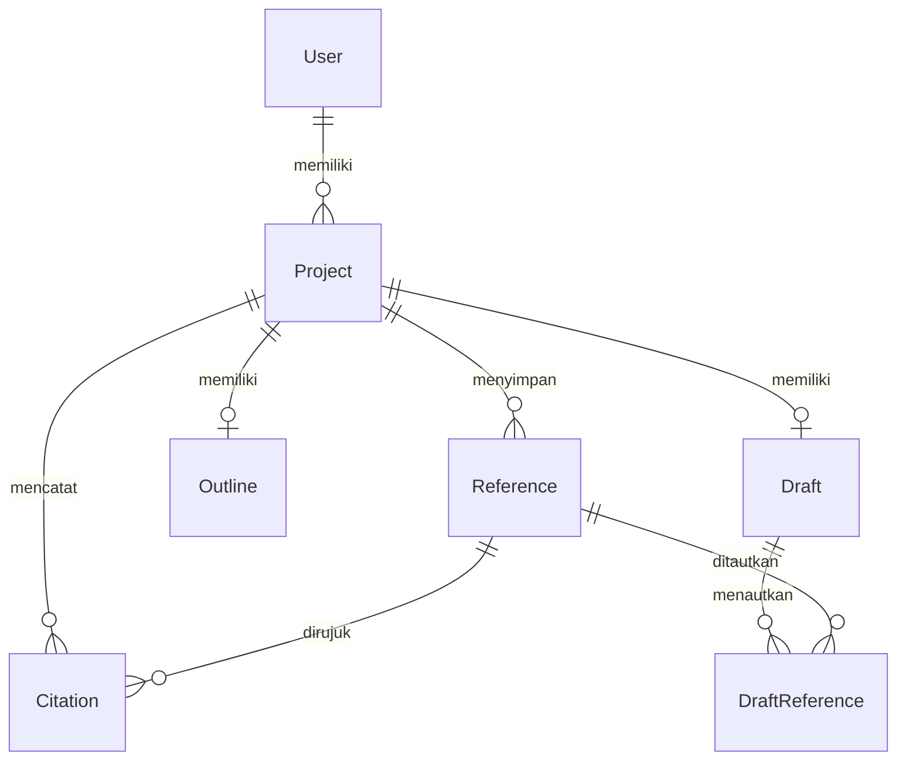

# Nama Produk

Aplikasi Pembuatan Karya Ilmiah Berbasis AI (nama sementara).

## Ringkasan

Aplikasi web untuk membantu mahasiswa S1, mahasiswa S2, dan peneliti membuat skripsi, tesis, karya ilmiah, serta artikel. Pengguna membuat proyek, memilih jenis tulisan, mencari dan memeriksa referensi, lalu meminta AI menyusun kerangka dan menghasilkan draf sesuai struktur jenis tulisan. Aplikasi mengelola sitasi dan daftar referensi menurut gaya yang dipilih, misalnya APA atau IEEE, serta mengekspor hasilnya sebagai file Word (`.docx`).

Scopus, SINTA, Google Scholar, ResearchGate, dan layanan sejenis adalah contoh sumber yang diinginkan pengguna. Metode akses dan izin penggunaan data tiap layanan belum dipastikan. Aplikasi tidak boleh mengklaim referensi kredibel, terindeks, atau mendukung pernyataan tertentu hanya berdasarkan nama layanan atau keluaran AI.

## Masalah

- Pengguna perlu menyusun tulisan dengan struktur yang berbeda untuk skripsi, tesis, karya ilmiah, dan artikel.
- Pengguna perlu menemukan referensi yang dapat ditelusuri, lalu memastikan sitasi dan daftar referensi merujuk pada sumber yang benar.
- Menyusun kerangka, draf, sitasi, dan file Word secara terpisah menyulitkan pengguna menjaga konsistensi dokumen.
- AI dapat menghasilkan rujukan atau pernyataan yang keliru. Produk perlu membedakan sumber yang ditemukan atau dimasukkan pengguna dari informasi yang hanya dihasilkan AI.

## Target User

- **Mahasiswa S1:** membuat skripsi atau karya ilmiah dengan bantuan kerangka, draf, dan referensi.
- **Mahasiswa S2:** membuat tesis dan mengelola sitasi serta daftar referensi.
- **Peneliti:** menyusun artikel atau karya ilmiah dan mengelola sumbernya.
- **Admin:** peran disebutkan, tetapi tugas dan cakupan aksesnya belum ditentukan.

## Tujuan Produk

1. Menghasilkan kerangka dan draf sesuai jenis tulisan yang dipilih pengguna.
2. Menghubungkan sumber yang digunakan dalam tulisan dengan referensi yang dapat diperiksa pengguna.
3. Menyusun sitasi dan daftar referensi menurut gaya yang dipilih.
4. Menghasilkan file Word yang memuat struktur, isi, sitasi, dan daftar referensi.

## Metrik Keberhasilan

Belum ditentukan.

## Scope MVP

- **F-01 (P0):** Masuk dengan Google dan mengakses proyek milik sendiri.
- **F-02 (P0):** Membuat proyek dengan judul dan jenis tulisan.
- **F-03 (P0):** Mencari serta menyimpan referensi dengan metadata dan tautan asal yang dapat diperiksa. Input manual tersedia jika integrasi pencarian belum siap.
- **F-04 (P0):** Mengelola sitasi dan daftar referensi menurut satu gaya sitasi yang dipilih untuk implementasi awal. Pilihan gaya pertama belum ditentukan; APA dan IEEE merupakan kebutuhan pengguna, bukan klaim bahwa keduanya sudah didukung.
- **F-05 (P0):** Menyusun kerangka berdasarkan jenis tulisan, lalu memungkinkan pengguna memeriksa dan mengubahnya sebelum pembuatan draf.
- **F-06 (P0):** Meminta AI menghasilkan draf berdasarkan kerangka dan referensi tersimpan, lalu mengedit dan menyimpan hasilnya.
- **F-07 (P0):** Mengekspor dokumen ke file Word (`.docx`) dengan struktur, draf, sitasi, dan daftar referensi yang tersedia.

**Keputusan yang harus dibuat sebelum implementasi:** struktur awal tiap jenis tulisan, penyedia dan metode akses referensi, layanan AI, gaya sitasi pertama, serta aturan format Word. Tanpa keputusan tersebut, hasil generasi dan ekspor belum dapat dinyatakan sesuai panduan tertentu.

## Non-Scope MVP

- Klaim otomatis bahwa referensi kredibel, terindeks Scopus/SINTA, atau mendukung isi draf tanpa verifikasi yang disepakati.
- Pengambilan teks penuh atau integrasi langsung ke Scopus, SINTA, Google Scholar, dan ResearchGate sebelum metode akses serta izinnya dipastikan.
- Jaminan bahwa draf AI bebas kesalahan, siap diajukan, atau memenuhi seluruh ketentuan kampus dan jurnal.
- Template khusus setiap kampus atau jurnal, sebelum panduan dan prioritasnya diberikan.
- Pemeriksaan plagiarisme, pengiriman naskah ke jurnal, dan alur persetujuan dosen pembimbing.
- Fitur operasional admin dan akses admin ke proyek pengguna lain, sebelum kebutuhannya dijelaskan.

## Fitur Utama

### F-01 · Masuk dengan Google dan akses proyek (P0)
- **User story:** Sebagai pengguna, saya ingin masuk dengan Google agar dapat membuka kembali proyek tulisan saya.
- **Perilaku:** Pengguna masuk melalui Google; aplikasi membuat atau menemukan akun, lalu menampilkan daftar proyek.
- **Aturan & validasi:** Server memverifikasi hasil autentikasi. Proyek hanya dapat diakses pemiliknya (asumsi). Peran `admin` tidak otomatis memberi akses ke proyek pengguna.
- **State & error:** Tampilkan status saat masuk; jika gagal atau dibatalkan, tampilkan pesan untuk mencoba kembali; jika sesi habis, minta masuk kembali; tolak akses ke proyek milik orang lain.
- **Hak akses:** Pengguna dan admin dapat masuk; cakupan akses admin belum ditentukan.
- **Terkait:** Halaman Masuk, Halaman Daftar Proyek; `GET /auth/google/redirect`, `GET /auth/google/callback`, `POST /logout`, `GET /api/me`; User.

### F-02 · Proyek tulisan dan jenis dokumen (P0)
- **User story:** Sebagai pengguna, saya ingin menentukan judul dan jenis tulisan agar aplikasi dapat menyiapkan struktur yang sesuai.
- **Perilaku:** Pengguna membuat proyek, mengisi judul, dan memilih skripsi, tesis, karya ilmiah, atau artikel. Pengguna dapat mengubah judul. Perubahan jenis tulisan setelah kerangka atau draf dibuat memerlukan aturan yang belum ditentukan.
- **Aturan & validasi:** Judul dan jenis tulisan wajib diisi. Daftar pilihan awal mengikuti jenis yang disebut pengguna; arti “dll” perlu diprioritaskan kemudian.
- **State & error:** Tampilkan keadaan daftar kosong, proses simpan, validasi isian, kegagalan simpan, dan proyek tidak ditemukan.
- **Hak akses:** Pengguna mengelola proyek miliknya.
- **Terkait:** Halaman Daftar Proyek, Halaman Detail Proyek; `GET /api/projects`, `POST /api/projects`, `GET /api/projects/{projectId}`, `PATCH /api/projects/{projectId}`; User, Project.

### F-03 · Pencarian dan daftar referensi (P0)
- **User story:** Sebagai pengguna, saya ingin menyimpan referensi yang dapat saya periksa sebelum dipakai untuk membuat tulisan.
- **Perilaku:** Pengguna mencari berdasarkan kata kunci melalui penyedia yang disetujui, membuka tautan asal, dan menyimpan hasil ke proyek. Pengguna juga dapat memasukkan metadata dan tautan secara manual (asumsi).
- **Aturan & validasi:** Referensi tersimpan wajib memiliki judul dan tautan asal yang valid (asumsi). Simpan metadata yang tersedia, seperti penulis, tahun, DOI, dan nama publikasi, tanpa mengisi data yang tidak diketahui dengan tebakan AI. Nama penyedia pencarian bukan bukti indeksasi atau kredibilitas.
- **State & error:** Tolak kata kunci kosong dan tautan tidak valid; tampilkan hasil kosong atau kegagalan penyedia secara jelas. Referensi dengan data yang belum memadai untuk gaya sitasi terpilih perlu ditandai untuk dilengkapi.
- **Hak akses:** Pengguna untuk proyek miliknya.
- **Terkait:** Halaman Referensi; `GET /api/references/search`, `GET /api/projects/{projectId}/references`, `POST /api/projects/{projectId}/references`; Project, Reference.

### F-04 · Sitasi dan daftar referensi (P0)
- **User story:** Sebagai pengguna, saya ingin sitasi dan daftar referensi mengikuti panduan seperti APA Style atau IEEE.
- **Perilaku:** Pengguna memilih gaya sitasi proyek; aplikasi menyusun tampilan sitasi dan entri daftar referensi dari metadata referensi tersimpan. Pengguna dapat melihat referensi yang metadatanya belum lengkap.
- **Aturan & validasi:** Gaya yang benar-benar didukung harus ditetapkan sebelum pengembangan. APA dan IEEE tidak boleh ditampilkan sebagai pilihan aktif sebelum aturan format dan pengujiannya tersedia. Sitasi wajib merujuk ke referensi dalam proyek yang sama. Aplikasi tidak mengarang penulis, tahun, DOI, atau nomor halaman yang tidak tersedia.
- **State & error:** Jika belum ada referensi, minta pengguna menyimpannya lebih dulu. Jika metadata tidak cukup, tampilkan field yang perlu dilengkapi, bukan hasil sitasi yang dinyatakan sudah sesuai panduan.
- **Hak akses:** Pengguna untuk proyek miliknya.
- **Terkait:** Halaman Sitasi; `GET /api/projects/{projectId}/citations`, `POST /api/projects/{projectId}/citations`, `GET /api/projects/{projectId}/bibliography`; Project, Reference, Citation.

### F-05 · Kerangka berdasarkan jenis tulisan (P0)
- **User story:** Sebagai pengguna, saya ingin AI menyiapkan bab dan subbab sesuai jenis tulisan agar saya dapat memeriksanya sebelum membuat draf.
- **Perilaku:** Pengguna meminta kerangka; aplikasi menggunakan jenis tulisan proyek dan aturan struktur yang telah ditetapkan untuk menghasilkan bab serta subbab. Pengguna dapat mengubah dan menyimpan kerangka sebelum meminta draf.
- **Aturan & validasi:** Struktur skripsi, tesis, karya ilmiah, dan artikel tidak boleh dianggap seragam. Isi baku per bab, subbab, dan aturan kampus atau jurnal belum diberikan. Hasil AI harus ditampilkan sebagai kerangka yang perlu diperiksa, bukan sebagai format resmi institusi.
- **State & error:** Tampilkan status saat generasi berjalan. Jika gagal, jangan mengganti kerangka tersimpan. Jika penyimpanan gagal, pertahankan perubahan yang masih terlihat di editor selama halaman terbuka (asumsi).
- **Hak akses:** Pengguna untuk proyek miliknya.
- **Terkait:** Halaman Kerangka; `GET /api/projects/{projectId}/outline`, `POST /api/projects/{projectId}/outline/generate`, `PUT /api/projects/{projectId}/outline`; Project, Outline.

### F-06 · Pembuatan draf dengan AI dan sumber (P0)
- **User story:** Sebagai pengguna, saya ingin AI membuat draf dari kerangka dan referensi tersimpan agar saya dapat memeriksa, memperbaiki, dan melanjutkan tulisan.
- **Perilaku:** Pengguna memilih bagian kerangka yang akan dibuat dan referensi proyek yang relevan (asumsi alur MVP). AI menghasilkan teks untuk bagian tersebut; pengguna meninjau, mengedit, dan menyimpannya. Aplikasi menampilkan sumber yang dikaitkan dengan bagian hasil.
- **Aturan & validasi:** AI hanya boleh membuat rujukan ke referensi yang tercatat dalam proyek. Jika sumber tidak cukup, aplikasi harus menyatakan keterbatasan itu, bukan membuat referensi baru atau mengklaim dukungan sumber. Pengaitan referensi tidak membuktikan bahwa setiap pernyataan benar; pengguna tetap perlu memeriksa isi dan sumber. Aturan penggunaan kutipan langsung serta nomor halaman belum ditentukan.
- **State & error:** Tampilkan status generasi dan kegagalan layanan AI. Kegagalan tidak boleh menimpa draf yang tersimpan. Pengguna tetap dapat menulis dan mengedit secara manual.
- **Hak akses:** Pengguna untuk proyek miliknya.
- **Terkait:** Halaman Draf; `GET /api/projects/{projectId}/draft`, `POST /api/projects/{projectId}/draft/generate`, `PUT /api/projects/{projectId}/draft`; Project, Outline, Draft, Reference, DraftReference.

### F-07 · Ekspor file Word (P0)
- **User story:** Sebagai pengguna, saya ingin mengunduh tulisan sebagai file Word yang tersusun agar dapat saya periksa dan sesuaikan dengan panduan kampus atau jurnal.
- **Perilaku:** Pengguna mengekspor proyek; aplikasi membuat `.docx` berisi judul, struktur bab atau bagian, draf, sitasi yang tersedia, dan daftar referensi.
- **Aturan & validasi:** Urutan bagian mengikuti kerangka tersimpan. Aturan margin, font, spasi, penomoran halaman, dan halaman awal belum ditentukan; aplikasi tidak boleh menyatakan file sudah sesuai format institusi tertentu. Sebelum ekspor, tampilkan peringatan jika ada bagian kosong atau metadata sitasi yang belum lengkap (asumsi).
- **State & error:** Tampilkan status pembuatan file. Jika gagal, beri pesan kegagalan dan jangan menyajikan file yang tidak lengkap sebagai hasil akhir.
- **Hak akses:** Pengguna untuk proyek miliknya.
- **Terkait:** Halaman Detail Proyek, Halaman Draf; `POST /api/projects/{projectId}/export/docx`; Project, Outline, Draft, Reference, Citation.

## Halaman dan Navigasi

| Halaman | Isi dan navigasi |
|---|---|
| Halaman Masuk | Tombol masuk dengan Google; setelah berhasil menuju Halaman Daftar Proyek. |
| Halaman Daftar Proyek | Daftar proyek dan formulir membuat proyek dengan judul serta jenis tulisan. |
| Halaman Detail Proyek | Ringkasan proyek, pilihan gaya sitasi, navigasi fitur, dan tindakan ekspor Word. |
| Halaman Referensi | Pencarian, hasil beserta tautan asal, input manual (asumsi), dan referensi tersimpan. |
| Halaman Sitasi | Sitasi, daftar referensi, gaya yang didukung, dan penanda metadata yang belum lengkap. |
| Halaman Kerangka | Bab dan subbab hasil AI yang dapat diperiksa, diubah, serta disimpan. |
| Halaman Draf | Pembuatan teks per bagian dengan AI, editor, dan referensi yang terkait. |

## User Flow

1. Pengguna masuk dengan Google, lalu membuat proyek dengan judul dan jenis tulisan.
2. Pengguna mencari serta memeriksa referensi, kemudian menyimpannya. Jika pencarian belum tersedia, pengguna memasukkan referensi secara manual (asumsi).
3. Pengguna memilih gaya sitasi yang didukung dan melengkapi metadata referensi yang diperlukan.
4. Pengguna meminta AI menyusun kerangka sesuai jenis tulisan, lalu memeriksa dan mengubah bab serta subbabnya.
5. Pengguna meminta AI membuat draf berdasarkan kerangka dan referensi tersimpan, lalu memeriksa serta mengedit hasilnya.
6. Pengguna memeriksa sitasi dan daftar referensi, kemudian mengekspor dokumen ke Word.
7. Pengguna membuka kembali proyek untuk melanjutkan perubahan.

## Struktur Data

Model berikut adalah rancangan awal (asumsi). Struktur rinci perlu disesuaikan dengan format kerangka, gaya sitasi, dan cara generasi AI yang dipilih.

**User**
- `id`: bigint, identitas internal.
- `google_id`: string, identitas akun Google.
- `email`: string.
- `role`: enum `pengguna|admin`; mekanisme pemberian peran admin belum ditentukan.

**Project**
- `id`: bigint.
- `user_id`: bigint, pemilik.
- `title`: string.
- `document_type`: enum atau string terbatas untuk skripsi, tesis, karya ilmiah, dan artikel.
- `citation_style`: string nullable, hanya berisi gaya yang sudah didukung.
- `created_at`, `updated_at`: datetime.

**Reference**
- `id`: bigint.
- `project_id`: bigint.
- `title`: string.
- `source_name`: string nullable, nama penyedia data atau sumber yang diketahui.
- `source_url`: string.
- `metadata`: json nullable, misalnya penulis, tahun, DOI, dan publikasi jika tersedia.
- `input_method`: enum `search|manual` (asumsi), untuk membedakan asal entri.

**Citation**
- `id`: bigint.
- `project_id`: bigint.
- `reference_id`: bigint.
- `content`: text nullable, jika pengguna perlu menyimpan catatan atau kutipan; kebutuhan field ini perlu divalidasi.
- Lokasi sitasi di draf dan format penyimpanannya belum ditentukan.

**Outline**
- `id`: bigint.
- `project_id`: bigint, unik untuk satu kerangka aktif per proyek (asumsi).
- `content`: json atau longText, bergantung pada keputusan format bab dan subbab.

**Draft**
- `id`: bigint.
- `project_id`: bigint, unik untuk satu draf aktif per proyek (asumsi).
- `content`: json atau longText, harus mempertahankan urutan bagian dan lokasi sitasi untuk ekspor Word.
- `updated_at`: datetime.

**DraftReference**
- `draft_id`: bigint.
- `reference_id`: bigint.
- Pasangan kedua field unik (asumsi). Relasi pada tingkat draf saja belum cukup untuk menunjukkan pernyataan atau bagian mana yang didukung sumber; lokasi sitasi perlu dirancang sebelum implementasi F-04, F-06, dan F-07.

## Diagram ERD

## API Endpoints

Rancangan endpoint berikut adalah asumsi implementasi. Semua endpoint proyek harus memeriksa kepemilikan di server. Bentuk permintaan dan respons generasi AI perlu ditetapkan setelah format kerangka dan draf dipilih.

| Method | Endpoint | Deskripsi | Auth |
|---|---|---|---|
| GET | `/auth/google/redirect` | Mulai masuk dengan Google | Tidak |
| GET | `/auth/google/callback` | Proses hasil masuk | Provider Google |
| POST | `/logout` | Akhiri sesi | Sesi |
| GET | `/api/me` | Ambil pengguna aktif | Sesi |
| GET | `/api/projects` | Daftar proyek milik pengguna | Sesi |
| POST | `/api/projects` | Buat proyek dengan judul dan jenis tulisan | Sesi |
| GET | `/api/projects/{projectId}` | Detail proyek | Pemilik |
| PATCH | `/api/projects/{projectId}` | Ubah data proyek yang diizinkan | Pemilik |
| GET | `/api/references/search` | Cari referensi melalui penyedia yang disetujui | Sesi |
| GET | `/api/projects/{projectId}/references` | Daftar referensi proyek | Pemilik |
| POST | `/api/projects/{projectId}/references` | Simpan referensi hasil pencarian atau input manual | Pemilik |
| GET | `/api/projects/{projectId}/citations` | Daftar sitasi proyek | Pemilik |
| POST | `/api/projects/{projectId}/citations` | Catat penggunaan referensi untuk sitasi | Pemilik |
| GET | `/api/projects/{projectId}/bibliography` | Ambil daftar referensi terformat | Pemilik |
| GET | `/api/projects/{projectId}/outline` | Ambil kerangka | Pemilik |
| POST | `/api/projects/{projectId}/outline/generate` | Minta AI membuat kerangka | Pemilik |
| PUT | `/api/projects/{projectId}/outline` | Simpan perubahan kerangka | Pemilik |
| GET | `/api/projects/{projectId}/draft` | Ambil draf dan sumber terkait | Pemilik |
| POST | `/api/projects/{projectId}/draft/generate` | Minta AI membuat draf untuk bagian terpilih | Pemilik |
| PUT | `/api/projects/{projectId}/draft` | Simpan draf dan hubungan sumber | Pemilik |
| POST | `/api/projects/{projectId}/export/docx` | Buat dan unduh file Word | Pemilik |

## Non-Functional Requirements

- **Performa:** Tampilkan status proses untuk pencarian, generasi AI, penyimpanan, dan ekspor. Target waktu respons belum ditentukan.
- **Keamanan:** Server memverifikasi autentikasi Google dan kepemilikan proyek. Kunci layanan AI dan penyedia data tidak dikirim ke browser. Pengaturan penyimpanan kunci harus disesuaikan dengan shared hosting yang dipilih.
- **Ketertelusuran sumber:** Pertahankan tautan asal dan metadata yang benar-benar tersedia. Bedakan referensi yang ditemukan melalui penyedia dari entri manual; jangan menyatakan salah satunya telah terverifikasi tanpa pemeriksaan.
- **Keandalan penyimpanan:** Kegagalan generasi AI atau ekspor tidak boleh menimpa draf dan kerangka yang sudah tersimpan.
- **Aksesibilitas:** Formulir memiliki label, pesan error berbentuk teks, dan dapat digunakan dengan keyboard (asumsi).
- **Batas operasional:** Batas proyek, panjang draf, jumlah referensi, ukuran file, dan batas permintaan AI belum ditentukan.

## Rekomendasi Tech Stack

- **Frontend:** Svelte, mengikuti pilihan pengguna, untuk pengelolaan proyek serta editor kerangka dan draf.
- **Backend:** Laravel, mengikuti pilihan pengguna, untuk Google Login, validasi akses, penyimpanan, permintaan ke layanan AI, pengelolaan sitasi, dan ekspor Word.
- **Database:** MySQL (asumsi), untuk relasi pengguna, proyek, referensi, sitasi, kerangka, dan draf; pastikan tersedia pada shared hosting.
- **Layanan AI:** Belum dipilih. Evaluasi harus mempertimbangkan kemampuan menghasilkan bagian dokumen dari kerangka dan referensi yang diberikan, batas permintaan, biaya, serta kebijakan pemrosesan data.
- **Pencarian referensi:** Penyedia belum dipilih. Periksa izin, metode akses, metadata yang tersedia, dan kemampuan menautkan hasil ke sumber asal sebelum integrasi.
- **Ekspor `.docx`:** Gunakan pustaka yang dapat dijalankan pada lingkungan PHP di shared hosting yang dipilih; pustaka dan format dokumen belum ditentukan.
- **Hosting:** Shared hosting sesuai pilihan pengguna. Periksa versi PHP, ekstensi yang tersedia, batas waktu proses, batas memori, dan dukungan proses latar sebelum menetapkan cara menjalankan generasi AI serta ekspor.

## Task Breakdown

Estimasi waktu belum ditentukan. Urutan berikut bergantung pada keputusan penyedia referensi, layanan AI, gaya sitasi, format dokumen, dan kemampuan shared hosting.

**Fase 1: Fondasi**
- [ ] [F-01] Siapkan Laravel, Svelte, konfigurasi shared hosting, Google Login, sesi, dan logout.
- [ ] [F-01, F-02] Buat skema pengguna dan proyek serta pemeriksaan kepemilikan di server.
- [ ] [F-02] Bangun pembuatan proyek dengan judul dan jenis tulisan.

**Fase 2: Referensi dan sitasi**
- [ ] [F-03] Validasi metode akses dan izin penyedia pencarian; tentukan penyedia pertama.
- [ ] [F-03] Bangun pencarian yang disetujui, input manual, dan penyimpanan metadata referensi.
- [ ] [F-04] Tetapkan gaya sitasi pertama dan aturan metadata yang diperlukan.
- [ ] [F-04] Bangun sitasi serta daftar referensi; uji hasil terhadap panduan gaya yang dipilih.

**Fase 3: Pembuatan tulisan**
- [ ] [F-05] Tetapkan struktur awal tiap jenis tulisan dan cara pengguna mengubahnya.
- [ ] [F-05] Bangun generasi, editor, dan penyimpanan kerangka.
- [ ] [F-06] Pilih layanan AI dan tetapkan instruksi agar AI memakai kerangka serta referensi proyek tanpa mengarang rujukan.
- [ ] [F-06] Bangun generasi draf per bagian, editor, penyimpanan, dan penautan sumber.

**Fase 4: Ekspor, verifikasi, dan rilis**
- [ ] [F-07] Tetapkan aturan format Word awal dan bangun ekspor `.docx`.
- [ ] [F-03, F-04, F-05, F-06, F-07] Uji referensi yang tidak lengkap, rujukan yang tidak ada, perbedaan gaya sitasi, struktur dokumen, dan isi file ekspor.
- [ ] [F-01, F-02, F-03, F-04, F-05, F-06, F-07] Uji hak akses, kegagalan layanan eksternal, penyimpanan, serta deployment pada shared hosting yang dipilih.

## Acceptance Criteria

### AC F-01 · Masuk dengan Google dan akses proyek
- [ ] Given pengguna belum masuk When membuka proyek Then aplikasi meminta pengguna masuk.
- [ ] Given autentikasi Google berhasil When callback diproses Then pengguna dapat membuka daftar proyek.
- [ ] Given proyek milik pengguna lain When pengguna membuka URL proyek tersebut Then aplikasi menolak akses.

### AC F-02 · Proyek tulisan dan jenis dokumen
- [ ] Given pengguna sudah masuk When menyimpan judul dan jenis tulisan yang tersedia Then proyek muncul dalam daftar miliknya.
- [ ] Given judul hanya berisi spasi atau jenis tulisan belum dipilih When pengguna menyimpan Then aplikasi menampilkan pesan validasi.
- [ ] Given proyek miliknya When pengguna mengubah judul Then judul baru tampil saat proyek dibuka kembali.

### AC F-03 · Pencarian dan daftar referensi
- [ ] Given penyedia pencarian yang disetujui tersedia When pengguna mencari Then aplikasi menampilkan metadata yang tersedia dan tautan asal hasil.
- [ ] Given referensi memiliki field wajib When pengguna menyimpannya Then referensi muncul pada daftar proyek dengan asal entri yang jelas.
- [ ] Given tautan input manual tidak valid When pengguna menyimpan Then aplikasi menolak entri.
- [ ] Given penyedia pencarian gagal When pengguna mencari Then aplikasi menampilkan kegagalan tanpa menyajikan hasil seolah pencarian berhasil.

### AC F-04 · Sitasi dan daftar referensi
- [ ] Given gaya sitasi telah didukung dan metadata referensi cukup When pengguna melihat sitasi serta daftar referensi Then aplikasi menampilkan keduanya sesuai aturan gaya yang telah diuji.
- [ ] Given metadata wajib untuk gaya terpilih tidak tersedia When pengguna melihat entri Then aplikasi menandai data yang perlu dilengkapi tanpa mengarang nilainya.
- [ ] Given referensi berasal dari proyek lain When pengguna mencoba membuat sitasi Then aplikasi menolak permintaan.

### AC F-05 · Kerangka berdasarkan jenis tulisan
- [ ] Given jenis tulisan dipilih When pengguna meminta kerangka Then aplikasi menghasilkan bab atau bagian dan subbagian berdasarkan aturan struktur untuk jenis tersebut.
- [ ] Given kerangka telah dibuat When pengguna mengubah dan menyimpan isinya Then perubahan tampil saat proyek dibuka kembali.
- [ ] Given generasi gagal When pengguna meminta kerangka Then kerangka yang sudah tersimpan tidak berubah.

### AC F-06 · Pembuatan draf dengan AI dan sumber
- [ ] Given kerangka dan referensi proyek tersedia When pengguna meminta draf suatu bagian Then aplikasi menghasilkan teks untuk bagian itu dan menampilkan referensi proyek yang dikaitkan.
- [ ] Given AI tidak memiliki dasar referensi yang memadai When pengguna meminta draf berbasis sumber Then aplikasi menyatakan keterbatasannya dan tidak membuat referensi fiktif.
- [ ] Given pengguna mengedit dan menyimpan draf When halaman dibuka kembali Then teks hasil edit tampil.
- [ ] Given referensi berasal dari proyek lain When pengguna mencoba menautkannya Then aplikasi menolak hubungan tersebut.
- [ ] Given generasi gagal When pengguna meminta draf Then draf yang sudah tersimpan tidak berubah.

### AC F-07 · Ekspor file Word
- [ ] Given proyek memiliki kerangka dan draf When pengguna mengekspor Then aplikasi menghasilkan file `.docx` yang dapat dibuka dan mempertahankan urutan bagian tersimpan.
- [ ] Given proyek memiliki sitasi dan daftar referensi yang dapat diformat When pengguna mengekspor Then keduanya tercantum dalam file sesuai gaya yang didukung.
- [ ] Given ada bagian kosong atau metadata sitasi belum lengkap When pengguna mengekspor Then aplikasi menampilkan peringatan tentang bagian yang perlu diperiksa.
- [ ] Given pembuatan file gagal When pengguna mengekspor Then aplikasi menampilkan kegagalan dan tidak menawarkan file yang tidak lengkap sebagai hasil akhir.

## Risiko dan Pertanyaan Terbuka

1. **Struktur tulisan:** Apa susunan bab, subbab, dan bagian awal yang diinginkan untuk skripsi, tesis, karya ilmiah, dan artikel? Apakah ada panduan kampus atau jurnal yang menjadi acuan pertama?
2. **Cakupan jenis tulisan:** Jenis dokumen apa saja yang termasuk “dll”, dan mana yang perlu didukung setelah empat jenis awal?
3. **Akses sumber:** Penyedia mana yang harus didukung pertama? Metode akses dan izin apa yang tersedia untuk Scopus, SINTA, Google Scholar, ResearchGate, atau layanan sejenis?
4. **Makna kredibel:** Kriteria dan bukti apa yang diperlukan sebelum aplikasi boleh menampilkan label kredibel atau terindeks?
5. **Layanan AI:** Penyedia apa yang akan digunakan, bagaimana biaya dan batas penggunaannya, serta data proyek apa yang boleh dikirim untuk generasi?
6. **Batas generasi:** Apakah AI membuat satu bagian per permintaan atau seluruh dokumen sekaligus? Alur per bagian menjadi asumsi MVP untuk memudahkan pemeriksaan dan penyimpanan.
7. **Sitasi:** Gaya mana yang harus didukung pertama, APA atau IEEE? Versi panduan apa yang menjadi acuan, dan bagaimana lokasi sitasi dalam teks disimpan?
8. **Format Word:** Apa aturan margin, font, spasi, penomoran halaman, daftar isi, halaman judul, serta format tabel atau gambar? Tanpa panduan, ekspor belum dapat diklaim sesuai ketentuan institusi.
9. **Peran admin:** Apa tugas admin dan apakah admin boleh melihat proyek pengguna? Akses lintas pengguna tetap ditutup sampai ada keputusan.
10. **Shared hosting:** Apa penyedia dan batas prosesnya? Generasi AI dan ekspor Word perlu diuji pada lingkungan tersebut.
11. **Pengelolaan data:** Apakah pengguna perlu menghapus proyek dan mengunduh atau memindahkan data selain file Word?
12. **Target keberhasilan:** Target dan periode evaluasi MVP belum ditentukan.
13. **Batas operasional:** Batas panjang draf, jumlah proyek dan referensi, ukuran dokumen, waktu respons, serta kebijakan penyimpanan data belum ditentukan.